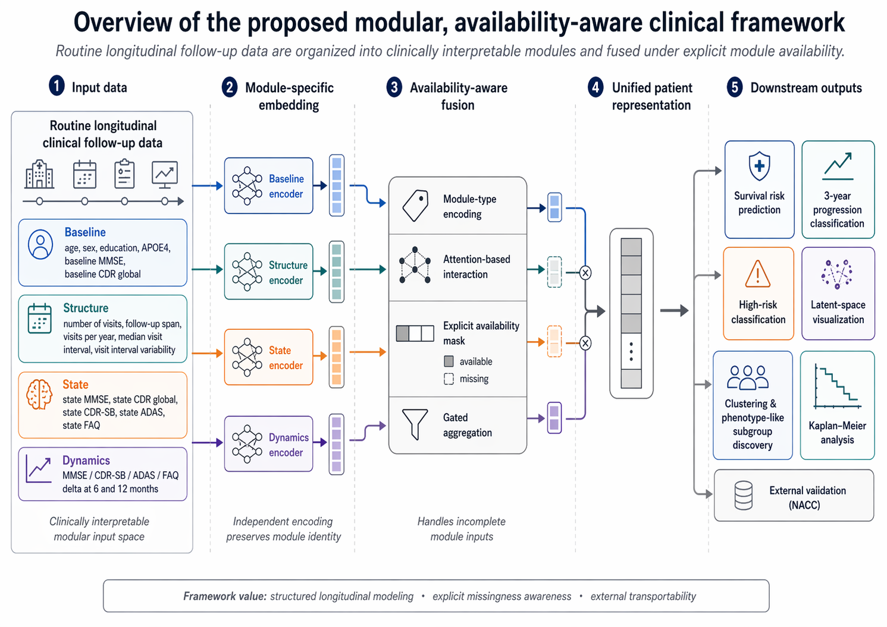

# AD_MCI_framework_v3

A modular, availability-aware clinical AI framework for longitudinal progression modeling in mild cognitive impairment (MCI) using routine follow-up data.

---

## Overview

Progression from mild cognitive impairment (MCI) to Alzheimer's disease is heterogeneous, time-dependent, and difficult to model in real-world clinical settings.  
Many existing studies rely on expensive or inconsistently available modalities such as PET, CSF, or MRI, limiting their applicability.

This project proposes a clinically realistic alternative:

> Leveraging routinely collected longitudinal follow-up data, organized into interpretable modules and fused under explicit data availability constraints.

The framework is designed to operate under irregular visits, missing measurements, and incomplete records — conditions commonly encountered in clinical practice.

---

## Framework



**Figure 1.** Overview of the proposed modular, availability-aware clinical framework.  
Patient data are decomposed into clinically interpretable modules, encoded independently, and fused using availability-aware mechanisms to produce unified representations for downstream prediction.

---

## Key Idea

Instead of treating longitudinal data as a single feature matrix, patient information is structured into four modules:

- **Baseline** — static patient profile  
- **Structure** — visit frequency and temporal organization  
- **State** — current clinical condition  
- **Dynamics** — short-term progression trends  

Each module captures a distinct clinical aspect and can be flexibly combined depending on data availability.

---

## Pipeline Overview

The full workflow follows a clinically motivated pipeline:

1. **Cohort construction (ADNI)**  
   Identify baseline MCI subjects and construct longitudinal follow-up trajectories.

2. **Label generation**  
   Define time-to-event outcomes for MCI-to-AD progression.

3. **Module construction**  
   Extract and organize patient data into baseline, structure, state, and dynamics modules.

4. **Model training**  
   Train survival models based on modular representations.

5. **Evaluation**
   - Internal validation (ADNI)
   - Kaplan–Meier survival analysis
   - External validation (NACC)
   - Baseline comparison (Cox / RSF / DeepSurv)
   - Missing-data robustness analysis

---

## Repository Structure

The repository is organized around a paper-oriented workflow:

- **src/**  
  Core implementation of the modular framework, including data processing, model architecture, and training logic.

- **scripts/**  
  End-to-end pipeline scripts for cohort construction, feature generation, model training, and evaluation.

- **results/**  
  Reproducible outputs corresponding to the manuscript:
  - figures (main and supplementary)
  - tables (performance, ablation, robustness)
  - model summaries

- **docs/**  
  Additional documentation, including data access notes.

- **data_processed/**  
  Placeholder for processed data (not included due to access restrictions).

---

## Key Scripts (Reproducibility)

The main pipeline can be reproduced using:

```bash
python scripts/01_build_adni_cohort.py
python scripts/02_build_labels.py
python scripts/03_build_modules.py
python scripts/04_make_splits.py

# Baseline models
python scripts/21_run_baseline_deepsurv.py

# Modular framework analysis
python scripts/22_run_modular_ablation_v2.py

Outputs are generated in:

results/figures/
results/tables/
results/models/
Results

The framework demonstrates:

Competitive performance compared to standard survival models (Cox, RSF, DeepSurv)
Clinically meaningful risk stratification via Kaplan–Meier analysis
Robustness under simulated missing data conditions
Consistent performance in external validation (NACC cohort)
Reproducibility
Code, figures, and tables are provided.
ADNI and NACC datasets are not included due to controlled access requirements.
Data access instructions are provided in docs/data_access_note.md.
Setup
conda env create -f environment.yml
conda activate <env_name>

Dependencies are also listed in requirements.txt.

Contact

📧 liqirui019@gmail.com
